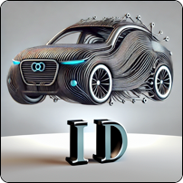

[![Contributors][contributors-shield]][contributors-url]
[![Forks][forks-shield]][forks-url]
[![Stargazers][stars-shield]][stars-url]
[![Issues][issues-shield]][issues-url]
[![MIT License][license-shield]][license-url]

 

  

  <h3 align="center">Mission Ready - Level 05 - Mission 01 - Research</h3>

  

    Turners Car Auctions - Insurance Premium Estimation with AI Vehicle Image Classification
     
    <a href="https://github.com/Astrotope/mr-level-05-fsd-mission-01-ai"><strong>Explore the docs »</strong></a>
     
     
    <a href="https://github.com/Astrotope/mr-level-05-fsd-mission-01-ai">View Demo</a>
    ·
    <a href="https://github.com/Astrotope/mr-level-05-fsd-mission-01-ai/issues/new?labels=bug&template=bug-report---.md">Report Bug</a>
    ·
    <a href="https://github.com/Astrotope/mr-level-05-fsd-mission-01-ai/issues/new?labels=enhancement&template=feature-request---.md">Request Feature</a>
  

<!-- TABLE OF CONTENTS -->

  
Table of Contents

  <ol>
    <li>
      <a href="#about-the-project">About The Project</a>
      <ul>
        <li><a href="#built-with">Built With</a></li>
      </ul>
    </li>
    <li>
      <a href="#getting-started">Getting Started</a>
      <ul>
        <li><a href="#prerequisites">Prerequisites</a></li>
        <li><a href="#installation">Installation</a></li>
      </ul>
    </li>
    <li><a href="#usage">Usage</a></li>
    <li><a href="#roadmap">Roadmap</a></li>
    <li><a href="#contributing">Contributing</a></li>
    <li><a href="#license">License</a></li>
    <li><a href="#contact">Contact</a></li>
    <li><a href="#acknowledgments">Acknowledgments</a></li>
  </ol>

<!-- ABOUT THE PROJECT -->
## About The Project

  

### The goal of this project is to prototype a solution that allows...

* A custom to upload the picture of a car 
* Identify the type of vehicle [and potentially make and model]
* Based on this information, calculate the appropriate insurance premium for the customer. 

### Propoesd implementation

* A cloud-based application that can recognise motor vehicles types (e.g. sedan vs SUV vs truck, or potentially recognise a few brands and/or models) using a cloud-based AI service on
  *  Microsoft Azure or,
  *  Amazon Web Services or,
  *  Google Cloud

  
* The solution does not need the business logic to calculate the insurance premium, as this will be handled by another team.

  You can use code from tutorials you find online, but make sure you read through the code so that you understand the code. 

(<a href="#readme-top">back to top</a>)

### Built With

This project was built using these framewords/libraries/services ...

* [![GitHub][GitHub]][GitHub-url]
* [![Azure App Services][Azure-App-Services]][Azure-App-Services-url]
* [![Azure AI Vision][Azure-AI-Vision]][Azure-AI-Vision-url]
* [![Express][Express.js]][Express-url]
* [![React][React.js]][React-url]
* [![React Router][React-Router]][React-Router-url]
* [![Sweet Alert 2][Sweet-Alert2]][Sweet-Alert2-url]

[GitHub]: https://img.shields.io/badge/GitHub-DD0031?style=for-the-badge&logo=github&logoColor=61DAF
[GitHub-url]: https://github.com/
[Azure-AI-Vision]: https://img.shields.io/badge/Azure_AI_Vision-FF2D20?style=for-the-badge&logoColor=white&logo=data:image/png;base64,iVBORw0KGgoAAAANSUhEUgAAABgAAAAYCAYAAADgdz34AAAACXBIWXMAAAsTAAALEwEAmpwYAAAFB0lEQVRIiY2UW2wUVRjHf2due6PdLmzbLW1ZLaIgdwMRC0KkIFGRQJBieAATn3jAaOIlJgYBNUYMiSFiiMZ4wSdCEGMQAUEEQ63hoqHUIrctNHWp2267y+52Z3bm+NDtdgsF/CeTmfPN//y/y/nOJ3Z02/JwVukGtMFHFyi7Q6wCvuPemAO0NEZpsSSjADVvFxN16RXvxBwLWD/fIy7ogusCegMqiYcMnP8hfhuaMqgSjKNpKVstcU5sjjnZjWOE6w58BRh9tSs76WBL3/SuRG6az6XGpta6W5+c4j8NXAX67+RsTZSEdpdg5m3Z17lsU3O8AagD3IDI/7OhI/pc2HPy7Wer9k+u9hwDoiNoOFo+ymE40ZZcuXRXx4tJx6kHRmlCkBcfdCCBcXvaM7V7Pr5Sv+nRwPcbl4/9Bjh1i5StqUKIYsuJtuTKBV9d26AJUR9QVV1VoNylU+FzU+rWZb9li3jGFJGbGQWgN+fUbWqOr+3L2qXbVtduB/4Y1NIEtpBSLgEO5m1PKG+ef6NEURr8uqKVe1zU+L34PcaINYzEkkSSafodScyyYx8tDH760uLKrUBfnrJBAY7kF4EXPo88D8yvcGtazSgPk0NlBfFEoo9r1yPc6Boq9X3BEqZV+PHrKgFVDb58NLaMgbYdxC4NyOUXc76+lFoSMjSPoSjUBUsKws0tZ4imksOiXzBpOuNqwoz2uanKWEA/8bQ9ccu+zqUbl48drEimcMDbDtxYBNQEDI2qEg9K/miaW86wfc0UOrav5qlwWcHBL3/9WcimotSDV9MI6qq2pzWxqCiObMHBuc7M3KCuqm5NpSxflmsd7YR9sGrBBKpHu1hRf/+wLE6cPwOA19Dw6Sp+XaUladcWcwr3oDORG+/XVVyqgtcYMN/4N0pbLMlbXzQxvS5IKmMR9um0p6yB/HM5TMvE0A1KXDpZ24G0OaztCwsVqQFoRV1r59/vHblI42dNVJeXEPK5uRNc6m1XasjB+HLXBctxUFWFbG5Aemywchi58bMmmruGDtujaRj6QDltKQcygJsjOpgd9h7uzNqWoSpYOUcC1NSEKXXfOeLHHn4EANN2UIUgYVosqnBdHNHBuseDP+ekvBrPmJi2jSMlihAsmDqbkK/kNvG5D06hujI04MCypa4K2Z6xsiumlR4v5hUPu1OvzCg9sOt8amxVqcfXb9nSa2iirCzA4von6O2N09MXx+X2UlVRWWhj03awpeR6X0Z4hDi/vqHi0K0Z1OW/E9tW1+6OWfbRjr60CZDN2dKREoCysgB14TqqK0PF4tK0bNlv2eJcIt355fLQtwwfeDOUd7vl6V/TDA6bk5FXH9h5tjd15GrPzSwgLduRpu1IR8phTzZnSymljGdMfov2/vPh/ODeFbMDe4FCF6y9wQnNAWmCBzABxo1xHXDen2w3bG3r//FKpmFywOcPlXhymksTDIxpBXC6U9lce1+Ky2nz7y+erty37vHgbqC1uDw5iaLlN3kYmoAAh468PrHnk5+6Wnf+3rN4XyQ5KWRovnK3oaZzOedy2uwHLr8203/8g8YJPwBNt+wfREpsjjmxeR4xa6GXyAgEAXiB8P6zvZPiaXuMzyW6V8wa3QZEgHQ+wBGxJsolTQF5MiPdC71iJI4EUkDrMzPLWkci3AOK2NFt24ezSk9RJEIXOLtDTAcM4NpdBFRgHGA0RjlmDeXiBvSJunT9B65iESKwcVT9AAAAAElFTkSuQmCC
[Azure-AI-Vision-url]: https://azure.microsoft.com/en-us/products/ai-services/ai-vision/
[Azure-App-Services]: https://img.shields.io/badge/Azure_App_Sevices-0769AD.svg?style=for-the-badge&logoColor=white&logo=data:image/png;base64,iVBORw0KGgoAAAANSUhEUgAAABgAAAAYCAYAAADgdz34AAAACXBIWXMAAAsTAAALEwEAmpwYAAAFbUlEQVRIiY2VTWxcVxXHf+feN2/ezHhixx7HHge7NondhjZuSNo6kIi6UtUSKiEWiNIKVAlaIbFgA0gVQiLs+BASLIBNF2yKgCJoI1rR8pGqalRCQ5ImboLTfOI09tj1x9iejzfz7j0sJnGaOqGcxVvcd+//d8957/yPqCr/T1RjLxffi33cVFIWRopRexiY5Q87J/8LcPzCqp6YWuVnh5a5WHEECMnaW+XhgYgndnfy0PZ2I8JNhW4KOD8XP/uDl0qPO+d4/J42njta4c+XYowI3rf2eFUaQNN59vak+ckX+t7b2hN1f1Ar+ODCL/82q989uEDGCGEgPDDs+NxojgtLMF3xYBUHbMoYdhTT9OQDunKG45dqhVI50T0jbXLLDJ45WNJv/XWBbMqQEyFlDQMbAr59fxvluvKLN6rs3ByxvS9Nd96iCqqKqlJteFZjx+hAhl2DOVkHODS5rMcurfCjQ6tE1hBZQ2AtKSPs6Q95YiyDDSzTqwY81JrKubmYiek6J6YblBsJdedJW3jtG0PfL3aE+wEMQNz08urpMvm0oSeypKwhsIa0FbqzAWNbcqgEtEdQbFP+cb7Gz18v84eJKqdmExytbNPGsOLghy/Nfu+Gb/D80SV/uewY6Eyx+yMRhXyICJyedTy2K08+sizUYXalSXvaMbjR8MaUJR0IIoKIA1oli1R59t+rfGWqqqP9WQkAfvuvJSp1z9fH2/j8WEQYtEq4VHVMl5W5Zc9rZ+pMzDo+PWy5s2j48o6Q359ssBwreEMgHmuElAhWhN8cXmS0P9sq0aErMV+6r4PhYmZNHKAja9ncYTg10+TMvBKlLK9egGPvwmDB8ORYmt68ZbiQYnd/mnv7IrZ2BITAc6dWWyV6p1QvJcD9IxkVTSS52kmqioiQCZSPdgn/nBIUQUQ5PKUsVpXxrYavjkWAcN9QCoADx6s8/coCc7GjVG7uDxpN3WSMENmm1GrNdU0HUMi2YK3cWs/Tc7BYdezbBh/fLNTrDoBPbRH36LbIPnOyysJq8p2g6RTvYXa+QlferBNXVebLAaqpG9eBi2WlvBJTrepaxqpq84EDFGuEIJs2i8DGg2fqPPIxWQdoJPCXcxtadxfB6zWwR1U5XfLcVait7fceetvbGC960oF5OxgshF1O1f/4zYSRgtCba2KlpRI7y4rLUXdCnHgCY1DAeSXxDuc8x2cskQh3dMYkCpPzaTZsEB7ZlqG/EO4MwsDoZ4cynF1ISKJNXHGONydnyYQBg8UOrBEeHBYmpj0nS47R3hSBhfas4cW361QSOHA+4ndnQuqJp5YkqC7z2F05jKABwBfv2ciLJ5dRhQvzjhfOh4SBYWQhZs9QSFeb4c5e4cHbU9zd3/LHxEFkPL86UqHhPA3naXpHQz0rTc+uwRxw1So+s6Nddg5kUFWOXK7T9ErilLMLTX79Vo2JdxOcV3pyDWq1GrVajWajxgNbW8KJUxre01Cl7mEwZ9m3o8PC++x6z3AunpyJ04enqjRVcCgOQ0Ph5XM1jk1b7u5WKv66+6rCk/dGlKuexZpjvuJInOdr45sIrfgbAHf0ZaLJmbrOxJ6cFbyAKFijOGO4vJJwttRkS5dfA5RWLekgojtvKOSELV2WznzIrqGb2PW12P/HK/rTI2UypuWmgRUCBCPCeDFhrNigJ++YrRheOBux1LAEBpzzPPXJTh79RNetB861OHB0Sb/5pxJLiWJFCAEjgjHX/3WvileoeeXhgTRP7+thtD+7rpFuOfSX6y58+a1y/PyJMn//T0zNt2Bcne23ZQ3be9I8tbeLvbfn13fo+wDXT90iGk7NO9N110iUKCX12wrpvqsO8KHxX8prldq76f1xAAAAAElFTkSuQmCC
[Azure-App-Services-url]: https://azure.microsoft.com/en-us/products/app-service/
[Express.js]: https://img.shields.io/badge/Express-563D7C?style=for-the-badge&logo=express&logoColor=white
[Express-url]: https://expressjs.com/ 
[React.js]: https://img.shields.io/badge/React-20232A?style=for-the-badge&logo=react&logoColor=61DAFB
[React-url]: https://reactjs.org/
[Sweet-Alert2]: https://img.shields.io/badge/Sweet_Alert_2-4A4A55.svg?style=for-the-badge&logoColor=white&logo=data:image/png;base64,iVBORw0KGgoAAAANSUhEUgAAABgAAAAXCAYAAAARIY8tAAAACXBIWXMAAAsTAAALEwEAmpwYAAAEfUlEQVRIiZWVy1NTdxTHPycvAyEkhISAvOQRBqKmqNUq07pw6qh11OnDTp3WLlqnnS678M/owkW76Ey7sovWWqed1im+xoJUBGt5RFEHBATlESBEbkguCffXBQVM44g9q/v7/e79fs7jnt8RpRQvamP3IspiM+Or8si/WwI8T8BuemF1ID6bQE+knt5ay7ukvGgESU1XidkkIoKjMBer3SJrfwWWDA9nEqr3Yj/b3wpitpolPpNQvefvMtIzjj3fRp7XgTIUT8bnSOuGqmkqJ3SwHrPFbDHSRvrG2TA7j25GTLICz4pg8NYj5SlzMdQ5wv0/hth+dBMbNrtQN5rBGkdps8iigbLncXeggNthC1ve3YKzyElsUqOuqTIjsmelSFq/6TAsNgsNewO4IpdRdzpQmoHYhPaRBjb5h3BMzYHXDHYTl3rr8DdtpfFw6L9pkyzAX+d6VTq5SNlGN5GWNkKuMGrWQJwmMMNsIg93jgbzCnJk6T8CLnaUUXNkF7Wvb82AmJRSucuL6GhMjfw9xivvhSgZOEPIFV46sAlKMwCWxIHHiz4exvwA9NxzUVsapfXrTgxdy/A4I4IrX11XwT01FE00o7rCiEvALDzRrDwYzedyqxuAQFWCHdvnWGcTUvMLdPQXUlajMzFspSTko/GjYytRZPTB9GCU4oI4DN8BAaXAMIRfW8ppOP4GJ1tOyMmWE1Lc1MB3PxQxNakoLNApcOgkdRP7jkfp75gBbVRlASJDM6ooUMj8cB8ISIEJsQi/XFnPB1/uJ6c+uOLVzk9flz2f1XPhmo+Wmz4C6zWGwjbSC0s1SU/dXq3Bw54xdfXbm0qLxMkvzqO9RQfgXqQCPW1jYNAOnvKsptp27FVJzgvB3Qmu9xUSeEnHYlPkexbRRodX3rNUhEqkIlTCUOeIEhE2lT2CFHjzYiQWbcgal4m/OsWR6unVogqgz65GsPyQW5CDFtHw5s2hdIXHPIt7nUZDXYJb37dnNUv32Ta1IbiQBdRiZnLy0tkAX3UhY3enEbsDLCC2pawceO0x7adv0/tz5wqk+2ybunCqj4Pvz2QB0guCLde5miKlVLGIjItJJN/vUNMJHx7zGCpqLBXbbeLE2w8495PO7190r0De/CSKPXcxQ7w/nEtlnQ7OqlWAiIwvLxoPB+k8Pcu+WsAhYILYnBWb1aCiOM6OA3NUBpJZXi9bV5uDQx9OIe767BQB+ANeya8upWeyGrEJj6YdXOj08+OlUgLlGtfPO7NEl+3aeTfBbfPYvaXgrl9tNKWUe3mxEF9QnppCJhbK6L7vAQXe4jSHPp7hapePilr9meJtzS7MVkXw5ThStjfjLOOqaD/Toxp2V+HyO+XPU7+px12D6CkTxz6PPFN4dMDOjctOAqEEoZ0apqp3wLPRxFOT7rkTbbC1R91v7iQ2qVNUmsLhMsCAWNTMzIQFf3mKxl0a+eu9SPl+cFZmiK8JWLFon4qEe4hPjCNGkjxXGk+xFXFUQMFGKNycJfz/AE+ZMlJKFGC2rjWTBTD/A+V63IMX4OsYAAAAAElFTkSuQmCC
[Sweet-Alert2-url]: https://sweetalert2.github.io/
[React-Router]: https://img.shields.io/badge/React_Router-FF2D20?style=for-the-badge&logo=react-router&logoColor=white
[React-Router-url]: https://reactrouter.com/

(<a href="#readme-top">back to top</a>)

### Disclaimer

This project is a concept demo and is for informational and educational purposes only. It references and uses the trade name of [Turners Car Auctions] as a conceptual basis. However, this project is not affiliated with, endorsed by, or officially connected to [Turners Car Auctions] in any way. All trademarks, service marks, trade names, and logos used in this demo are the property of their respective owners. The inclusion of the business name and any associated references are solely for illustrative purposes and do not imply any official association or representation of [Turners Car Auctions].

<!-- GETTING STARTED -->
## Project Log

See... [Project Log](PROJECT_LOG.md)

<!-- ROADMAP -->
## Delvelopment Micro-Sprints (1.5 hours)

- [x] [Sprint-01] Create GitHub repository and this README.md
- [ ] [Sprint-02] Research Azure Vision Service
- [ ] [Sprint-03] 

See the [open issues](https://github.com/Astrotope/mr-level-05-fsd-mission-01-ai/issues) for a full list of proposed features (and known issues).

(<a href="#readme-top">back to top</a>)

<!-- CONTRIBUTING -->
## Contributing

Contributions are what make the open source community such an amazing place to learn, inspire, and create. Any contributions you make are **greatly appreciated**.

If you have a suggestion that would make this better, please fork the repo and create a pull request. You can also simply open an issue with the tag "enhancement".
Don't forget to give the project a star! Thanks again!

1. Fork the Project
2. Create your Feature Branch (`git checkout -b feature/AmazingFeature`)
3. Commit your Changes (`git commit -m 'Add some AmazingFeature'`)
4. Push to the Branch (`git push origin feature/AmazingFeature`)
5. Open a Pull Request

### Top contributors:

(<a href="#readme-top">back to top</a>)

<!-- LICENSE -->
## License

Distributed under the MIT License. See `LICENSE.txt` for more information.

(<a href="#readme-top">back to top</a>)

<!-- CONTACT -->
## Contact

Astrotope - [Astrotope](https://github.com/Astrotope/mr-level-05-fsd-mission-01-ai)

Project Link: [https://github.com/Astrotope/mr-level-05-fsd-mission-01-ai](https://github.com/Astrotope/mr-level-05-fsd-mission-01-ai)

(<a href="#readme-top">back to top</a>)

<!-- ACKNOWLEDGMENTS -->
## Acknowledgments

Use this space to list resources you find helpful and would like to give credit to. I've included a few of my favorites to kick things off!

* [Choose an Open Source License](https://choosealicense.com)
* [GitHub Emoji Cheat Sheet](https://www.webpagefx.com/tools/emoji-cheat-sheet)
* [Img Shields](https://shields.io)
* [GitHub Pages](https://pages.github.com)
* [Font Awesome](https://fontawesome.com)
* [React Icons](https://react-icons.github.io/react-icons/search)
* [Base64 PNG Encoder](https://www.base64-image.de/)
* [Base64 Encoder - Text/SVG](https://www.base64encode.org/)
* [Choose a License](https://choosealicense.com/)
* [Azure Icon Set](https://code.benco.io/icon-collection/azure-icons/)

(<a href="#readme-top">back to top</a>)

<!-- MARKDOWN LINKS & IMAGES -->
<!-- https://www.markdownguide.org/basic-syntax/#reference-style-links -->
[contributors-shield]: https://img.shields.io/github/contributors/Astrotope/mr-level-05-fsd-mission-01-ai.svg?style=for-the-badge
[contributors-url]: https://github.com/Astrotope/mr-level-05-fsd-mission-01-ai/graphs/contributors
[forks-shield]: https://img.shields.io/github/forks/Astrotope/mr-level-05-fsd-mission-01-ai.svg?style=for-the-badge
[forks-url]: https://github.com/Astrotope/mr-level-05-fsd-mission-01-ai/network/members
[stars-shield]: https://img.shields.io/github/stars/Astrotope/mr-level-05-fsd-mission-01-ai.svg?style=for-the-badge
[stars-url]: https://github.com/Astrotope/mr-level-05-fsd-mission-01-ai/stargazers
[issues-shield]: https://img.shields.io/github/issues/Astrotope/mr-level-05-fsd-mission-01-ai.svg?style=for-the-badge
[issues-url]: https://github.com/Astrotope/mr-level-05-fsd-mission-01-ai/issues
[license-shield]: https://img.shields.io/github/license/Astrotope/mr-level-05-fsd-mission-01-ai.svg?style=for-the-badge
[license-url]: https://github.com/Astrotope/mr-level-05-fsd-mission-01-ai/blob/master/LICENSE.txt

[Next.js]: https://img.shields.io/badge/next.js-000000?style=for-the-badge&logo=nextdotjs&logoColor=white
[Next-url]: https://nextjs.org/
[Vue.js]: https://img.shields.io/badge/Vue.js-35495E?style=for-the-badge&logo=vuedotjs&logoColor=4FC08D
[Vue-url]: https://vuejs.org/
[Angular.io]: https://img.shields.io/badge/Angular-DD0031?style=for-the-badge&logo=angular&logoColor=white
[Angular-url]: https://angular.io/
[Svelte.dev]: https://img.shields.io/badge/Svelte-4A4A55?style=for-the-badge&logo=svelte&logoColor=FF3E00
[Svelte-url]: https://svelte.dev/
[Laravel.com]: https://img.shields.io/badge/Laravel-FF2D20?style=for-the-badge&logo=laravel&logoColor=white
[Laravel-url]: https://laravel.com
[Bootstrap.com]: https://img.shields.io/badge/Bootstrap-563D7C?style=for-the-badge&logo=bootstrap&logoColor=white
[Bootstrap-url]: https://getbootstrap.com
[JQuery.com]: https://img.shields.io/badge/jQuery-0769AD?style=for-the-badge&logo=jquery&logoColor=white
[JQuery-url]: https://jquery.com 

